<div align="left">
<table>
<tr>
<td valign="top" width="50%">

```ini
[identity]
role        = Full-Stack Developer
              Systems Architect
              Pentester
focus       = Backend, low-level, security
philosophy  = Understand systems at the
              lowest level possible

[current_focus]
primary     = Cybersecurity & Pentesting
secondary   = Systems Architecture
learning    = Reverse Engineering & cybersec, ISOs and more

[languages]
low_level   = C · C++ · Assembly · Rust
backend     = Python · PHP · Java · Kotlin
frontend    = JavaScript · TypeScript
              HTML · CSS · Dart

[frameworks]
backend     = Express · Flask
frontend    = TailwindCSS · Bootstrap
mobile      = Flutter

[tools & misc]
infra       = Docker · Nginx · Git · Bash
databases   = PostgreSQL · MySQL
monitoring  = Prometheus · Grafana
systems     = Ubuntu · Debian · GCC · CMake
security    = Nmap · Metasploit
              Burp Suite · IDA Pro
other       = NPM · Discord.js

[releases]
apps        = EduQR · IssueBoard 

```
</td>
<td valign="top" width="50%">

</td>
</tr>
</table>
</div>
